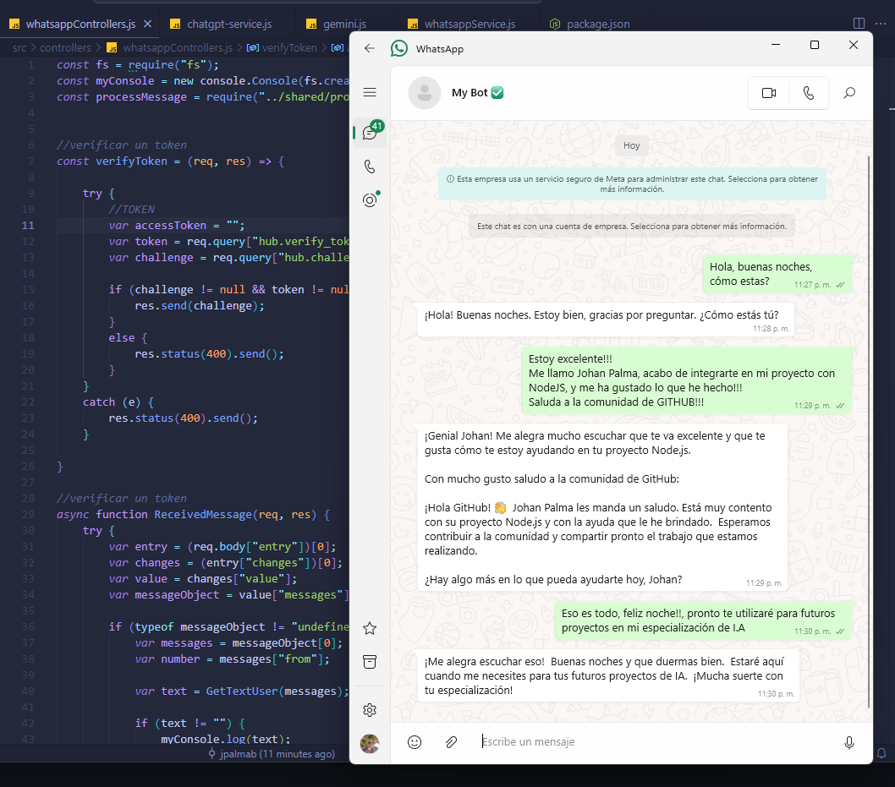

Este es un proyecto que permite crear un asistente virtual personal directamente en whatsapp, cuenta con inteligencia artificial (gemini) para poder consultar información respectiva de lo que se requiera.
Las tecnologías y herramientas utilizadas fueron:
1. Node JS
2. AZURE para alojar el proyecto y que se pueda realizar una petición en cualquier momento
3. WhatsApp Api para poder enviar los promps y recibir una respuesta por parte del usuario.
4. Gemini (IA)

NOTA: CABE RESALTAR QUE EL PROYECTO TIENE INTELIGENCIA ARTIFICIAL EMPLEADA POR GEMINI, PERO TAMBIÉN SE PUEDE CONECTAR LA DE OPEN AI (CHATGPT) COMO ESTÁ EN EL PROYECTO, TAMBIÉN 
TENGO PARTE DOCUMENTADA EN DONDE SE PUEDE NO UTILIZAR ESTAS IA, SINO EMPEZAR A PASARLE CONDICIONALES Y TEXTO A VOLUNTAD PROPIA.

